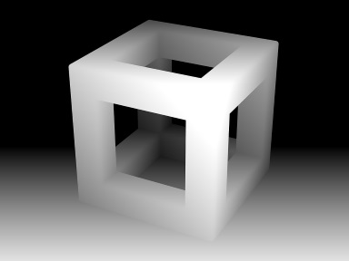
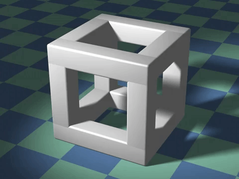

# Gif3DFromDepthMap_dev

Simple processing app to create gif-like wigglegram display.
feed the program a picture and a depth map corresponding to it, it will make it pop !

 

----------------

##How to use ?
one RGB and one depth map are all that is required.
Many data input images are available in the "data" folder

Several parameters are configurable with a simple UI

 + 

= 
----------------

made by myro_973 - 2017.11
www.instagram.com/myro_973/
